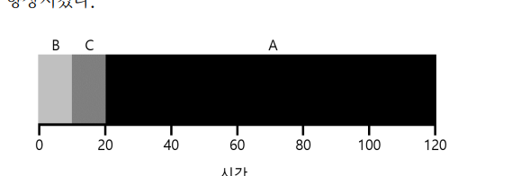

# 10. 스케줄링 : 개요

> 이전에는 프로세스를 실행시키기 위한 기법 중 low-level들(ex. context switching)을 공부함.  
> 이제 high-level policy(= discipline) 중 scheduling policy를 알아보자.  

스케줄링 정책을 개발할 떄 핵심  
- 핵심 가정은 무엇인가?  
- 어떤 평가 기준이 중요한가?
- 기본 접근 법은 무엇인가?

## 10.1 워크로드에 대한 가정
먼저 프로세스들이 실행되는 상황을 workload라고 한다.  
스케줄링 정책을 이야기 하기 전에 프로세스에 대해 몇가지 가정이 필요하다.  
이 가정은 비현실 적이다.  
1. 모든 작업은 같은 시간 동안 실행 된다.
2. 모든 작업은 동시에 도착한다.
3. 각 작업은 시작되면 완료될 때까지 실행된다.(중간에 멈추지 않는다.)
4. 모든 작업은 CPU만 사용한다.(즉, 입출력을 수행하지 않는다.)
5. 각 작업의 실행 시간은 사전에 알려져 있다.(스케줄러가 모든 것을 알고 있다.)

## 10.2 스케줄링 평가 항목(scheduling metric)
> 각 스케줄링 정책의 비교를 위해 스케줄링 평가 항목을 결정. 스케줄링에는 다양한 평가 기준이 존재하지만  
> 우선 `반환시간(turnaround time)` 하나만 평가 기준으로 사용.

$T(turnarund) = T(Completion) - T(arrival)$ 

반환시간 = 작업이 완료된 시각에서 작엉ㅂ이 시스템이 도착한 시각을 뺀 시간으로 정의.  
즉, 시스템에서 작업을 처리하는데 걸린 시간. 
번환 시간은 성능 측면에서의 평가 기준.

## 10.3 선입선출 (First In First Out, FIFO)
가장 기초적인 알고리즘. First Come First Served(FCFS)라고도 함.  
단순하고 구현하기 쉽다는 장점.

이 예시처럼 모든 작업이 동시에 도착하고, 모두 같은 시간동인 실행된다면 turnaround time은 20이다.

$$
{(10 + 20 + 30) \over 3} = 20
$$

하지만, 작업의 실행시간이 모두 같지 않아 다음과 같이 실행된다면, 성능이 나빠진다.

 
 
$$
turnaround time = {(100 + 110 + 120) \over 3} = 110
$$

 >convoy effect라 불리는 이 문제점은 '짧은 시간 동안 자원(=CPU)을 사용할 프로세스들이 자원을 오랫동안 사용하는 프로세스의 종료를 기다리는 현상'을 말한다.

 convoy effect를 해결할 다른 정책은?

 ## 10.4 최단 작업 우선 (Shortest Job Firrst, SJF)
 > SJF의 원칙
 >> 가장 짧은 실행 시간을 가진 작업을 우선 실행

위와 같은 예시를 sjf로 실행한다면 

 

 $$
turnaround time = {(10 + 20 + 120) \over 3} = 50
$$

turnaround time	은 110초에서 50초로 두배 이상 향상된다.  
모든 작업이 동시에 도착한다면 SJF가 최적의 알고리즘이다.  
하지만 모든 작업이 동시도착이 아니라면?  

$$
turnaround time = {(100 + (100-10) + (120-10)) \over 3} = 103.33
$$

B, C가 근소한 차이로 조금만 늦게 도착하더라고 FIFO에서와 같은 convoy문제가 발생한다.  

이 문제를 해결하려면?

## 10.5 최소 잔여시간 우선(Shortest Time-to Completion FIrst, STCF)

가정 3번. <작업은 끝날 떄 까지 계속 실행된다>를 완화하면 문제가 해결된다.

> STCF 방식  
> 새로운 작업이 시스템에 들어오면, 스케줄러는 (현재 실행중인 프로세스의) 남아있는 시간과, 
> 새로운 작업의 실행 시간을 계산하고, 그 중 가장 실행 시간이 적게 남아있는 작업을 우선 스케줄 한다.

STCF로 스케줄링 한다면 다음과 같이 실행된다.

$$
turnaround time = {((120-0) + (20-10) + (30-10)) \over 3} = 50
$$

이처럼 작업시간이 다르고, 도착 시간이 다르다면 STCF가 최적의 스케줄링이 된다.

