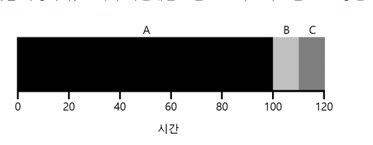
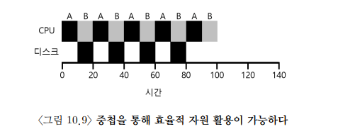

<aside>
💡 스케줄링 정책은 어떻게 개발하는가?

**가정을 먼저 세운다**. (비현실적인 가정)

1. 모든 작업은 같은 시간 동안 실행된다
2. 모든 작업은 동시에 도착한다.
3. 각 작업은 시작되면 완료될 때까지 실행된다.
4. 모든 작업은 CPU만 사용한다 (즉, 입출력을 수행하지 않는다).
5. 각 작업의 실행 시간은 사전에 알려져 있다

이 **가정들을 하나씩 완화**시켜 **현실적인 가정을 만족하는 알고리즘을 찾아**야 한다.

</aside>

## 워크 로드(workload)

일련의 프로세스들이 실행하는 상황

이 상황을 어떻게 결정할 지는 매우 중요

## 스케줄링 평가 항목

1. 반환 시간 
    - 반환 시간 = 작업이 완료된 시각 - 작업이 시스템에 도착한 시각
    - 성능 측면에서의 평가 기준
2. 공정성
    1.  Jain’s Fairness Index 등을 이용해 측정

스케줄링에서 성능과 공정성을 맞추긴 어렵다.

# 스케줄링 알고리즘

## First Come First Service(선도착선처리)

A, B, C가 거의 동시에 도착했다고 가정하자 (Tarrival = 0)

A의 반환 시간(10) = 완료된 시각(10) - 도착 시각 (0)

B의 반환 시간(20) = 완료된 시각(20) - 도착 시각 (0)

C의 반환 시간(30) = 완료된 시각(30) - 도착 시각 (0)

총합 60 → 평균 20 

이 스케줄링은 별로 좋지 않다.

앞의 프로세스 실행 시간이 길다면, 짧은 프로세스 임에도 불구하고 오래도록 기다려야 하기 때문이다. ex) 밑에 예시

도착 시간이 모두 0이라면, (100 + 110 + 120) / 3 이라는 평균 반환 시간을 가진다. 

> convoy effect
> 
> 
> 짧은 시간 동안 자원을 사용할 프로세스들이 자원을 오랫동안 사용하는 프로세스의 종료를 기다리는 현상을 말한다
> 

- 실생활 예시
    
    슈퍼마켓에서 고기 하나 계산하려 하는데, 앞에 카트 세 개를 꽉꽉 채워서 계산 하려 한다. 
    

더 좋은 해결방안은 무엇인가?

빠른 것을 먼저 실행 시켜?

## 최단 작업 우선(Shortest Job First, SJF)

> SJF의 원칙
> 
> 
> 문제의 장소가 고객 만족을 중요시한다면 SJF의 사용을 고려했을
> 가능성이 높다
> 

**도착 시각이 같은 프로세스 중**에서 **가장 짧은 실행 시간을 가진 프로세스를 먼저 실행**시키는 것

FCFS에서 봤던 그림에 이 알고리즘을 적용한다면?

(10 + 20 + 120) / 3 으로 반환시간이 50으로 감소했다. (2배 성능 향상)

문제

1. 도착 시간이 동일하지 않다면?

동일하게 convey effect 가 발생한다.

## 최소 잔여시간 우선(Shortest Time-to-Completion First, STCF) or 선점형 최단 작업 우선(PSJF)

1. 새로운 작업이 시스템에 들어오면, 남아 있는 작업과 새로운 작업의 잔여 실행 시간을 계산한다.
2. 제일 적은 잔여 실행 시간을 갖고 있는 작업을 실행시킨다. 

A 반환 시간 = 120 - 0

B 반환 시간 = 20 - 10

C 반환 시간 = 30 - 10

(10 + 20 + 120) / 3 = 50으로 

지금까지의 가정으로 만들어낸 알고리즘에서 제일 빠르다. 

## 응답 시간

**시분할 컴퓨터의 등장**으로 **응답 시간**이라는 **평가 기준이 새로 생겨**났다….

시스템과 상호작용을 원활히 하기 위한 성능이 필요

응답 시간 = 처음 스케줄 될 때까지의 시간 - 도착 시각

응답 시간 계산

A (0) = (첫 스케줄 시작 시간)0 - (도착 시간)0

B (0) = (첫 스케줄 시작 시간)10 - (도착 시간)10

C (10) = (첫 스케줄 시작 시간) 20 - (도착 시간) 10

평균 응답 시간(3.3) = (0 + 0 + 10) / 3

반환 시간으론 매우 훌륭하다. 

응답 시간과 상호작용 측면으로 보면 매우 나쁘다.

내가 터미널에 입력하는 것도 하나의 작업이라 처리가 늦어지게 될 것

타이핑을 쳤는데, 10초 뒤에 실행된다고 생각해보자… 으악

응답 시간을 어떻게 줄일 수 있을까?

## 라운드 로빈(Round-Robin, RR) (타임 슬라이싱)

작업이 끝날 때까지 기다리지 않는다. 

일정 시간만 실행하고, 실행 큐의 다음 작업으로 전환한다.

**실행되는 일정 시간을 타임 슬라이스(time slice) or 스케줄링 퀸텀(scheduling quantum)**이라 부른다.

타임 슬라이스의 길이는 타이머 인터럽트 주기의 배수 (당연하다)

타임 슬라이스를 짧게 할 수록 응답시간은 좋아지지만 문맥 교환 비용이 매우 비대해질 수 있어서 밸런스가 맞는 시간으로 설정해야 한다.

> 
> 
> 
> 예를 들어, 타임 슬라이스는 10 msec로 설정되고 문맥 교환 비용이 1 msec라면 대박 10%의 시간이 문맥 교환에 사용되고 따라서 낭비된다.
> 이 비용을 상쇄하고 싶은 경우, 타임 슬라이스를 예로 들어 100 msec로 늘릴 수 있다.
> 
> 문맥 교환 비용을 상쇄할 수 있을 만큼 길어야 하지만 그렇다고
> 응답 시간이 너무 길어지면 안 된다
> 

문맥 교환 비용 (꽤나 크다)

1. 레지스터 저장 및 복원
2. CPU 캐시
3. TLB
4. 분기 예측
5. 외에 다른 하드웨어 작업

## 중간 정리

지금까지 만든 알고리즘

첫 번째 유형은 (SJF, STCF) 반환 시간을 최적화하지만 응답 시간은 나쁘다.

두 번째 유형은 (RR) 응답 시간을 최적화하지만 반환 시간이 나쁘다.

완화해야 하는 가정도 두 개가 남아 있다.

가정 4 : 작업은 입출력을 하지 않는다

가정 5 : 각 작업의 실행 시간은 알려져 있다

## 입출력 연산의 고려

입출력이 없는 프로그램은 말도 안 된다.

입출력을 요청한 작업은 입출력이 완료될 때 까지 CPU를 쓰지 않는다. 대기 상태로 돌아간다. 그렇다는 것은 **다른 작업이 CPU를 할당 받아야** 한다. 

입출력이 완료 될 때도 의사 결정을 해야 한다. (인터럽트 발생)

스케줄러는 대화형 프로세스가 더 자주, 즉 유리하게 실행되는 것을 보장한다.

## 요약

마지막 가정(실행 시간을 알고 있다)만 남았는데, 

사실 실행 시간을 알 방법은 없다 ㅋ 

반환 시간은 빠르나 응답 시간이 좋지 않은 것

응답 시간은 빠르나 반환 시간은 좋지 않은 것 

두 가지를 만들어 보았고 절충을 요구할 수 밖에 없다. 

다음 장에선 

가까운 과거를 이용하여 미래를 예측하는 스케줄러(멀티 레벨 피드백 큐(multi-level feedback queue))를 구현

---

## 비선점형, 선점형 스케줄링

선점형 스케줄링

프로세스가 실행이 끝나지 않았는데 CPU를 가로채는 것

비선점형 스케줄링

프로세스가 종료되기 까지 기다리는 스케줄링

이번 정리와 6장 정리에서 봤듯, 요즘 나오는 스케줄링은 모두 선점형 스케줄링이다.